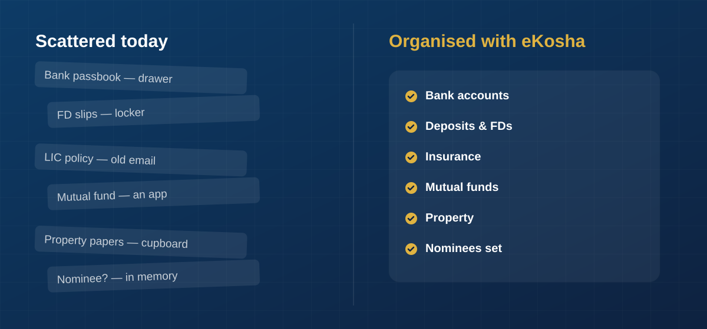
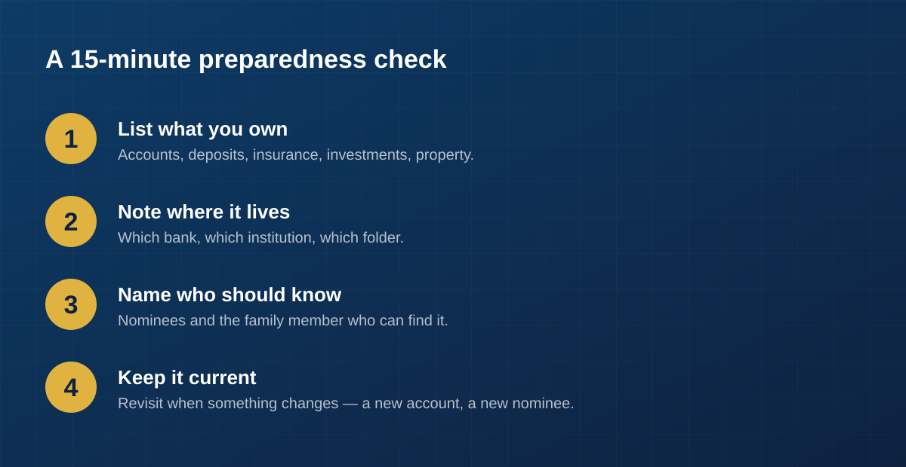

It's not a comfortable question, and that's exactly why most of us never sit with
it. But it's worth a quiet moment: if you weren't around to explain things
tomorrow, would the people you love actually know what you own?

Not in a dramatic sense. Just practically. Which banks hold your accounts. Whether
that old insurance policy is still active. The name of the mutual fund you started
years ago and quietly forgot. Where the property papers are. Who the nominee is —
and whether it's still the right person.

For most families, the honest answer is: *not really.* And that gap isn't a sign
of carelessness. It's just how financial lives tend to grow — one account, one
policy, one app at a time, over many years.

## The problem isn't money. It's memory.

Here's the pattern we see again and again. In most households, one person handles
the money. They know where everything is, more or less. It all lives in their
head, backed up by a drawer of papers and a few remembered passwords.

That works — right up until it doesn't. If that one person is suddenly unavailable,
even for a while, the rest of the family is left guessing. Not because anything was
hidden, but because the knowledge was never written down anywhere the family could
reach.

This is the quiet risk in a lot of Indian households: the financial picture depends
entirely on a single person's memory. Everyone assumes someone else "probably
knows." Often, nobody does.

## A familiar scene

Picture a family a few months after an unexpected illness. There's no shortage of
love or willingness to help — but there is a scramble. Was there a second bank
account somewhere? A term insurance policy someone vaguely remembers being
mentioned? Which of these fixed deposits have matured? Is there a nominee on the
demat account, or not?

Every one of these questions has an answer. The money exists. The policies are
real. The trouble is that the *information* is scattered — a passbook in one drawer,
a policy document in an old email, an investment inside an app nobody else can open.

The result is stress layered on top of an already hard time, and sometimes real
value that goes unclaimed simply because no one knew it was there.

## What "being prepared" actually means

Financial preparedness isn't about having more money, or about complicated planning.
It's simpler and more human than that. It comes down to three things:

- **Knowing what exists** — a complete list of what your family owns.
- **Knowing where it lives** — which institution, which account, which folder.
- **Knowing who should know** — the family members who can find it when needed.

That's it. When those three things are true, your family isn't left guessing. They
know what's there, where to look, and what to do next. That knowledge is what turns
a frightening, disorganised moment into a manageable one.

## A 15-minute preparedness check

You don't need a lawyer or a spreadsheet to start. You need about fifteen minutes
and a willingness to write things down.

1. **List what you own.** Bank accounts, fixed deposits, insurance policies, mutual
   funds and shares, provident funds, property, lockers. Don't worry about being
   perfect — start with what you can remember and add to it over time.
2. **Note where it lives.** For each one, jot down the institution and enough detail
   that someone could actually locate it. A policy number. A bank and branch. The
   app it's held in.
3. **Name who should know.** Decide who in your family should be able to find this
   information, and make sure the nominees on each asset are current and correct.
4. **Keep it current.** Revisit it when something changes — a new account, a closed
   policy, a new nominee. Preparedness is a habit, not a one-time task.

Even doing just the first step puts your family in a far better position than most.

## Where eKosha fits

We built eKosha to make this easy to do — and easy to keep doing. It's a private,
encrypted place to organise exactly this kind of information, so it doesn't have to
live in one person's memory.

With eKosha today, you can:

- **Record what you own** across the asset types Indian families actually hold —
  bank accounts, deposits, insurance, mutual funds and shares, gold, property,
  provident and pension funds, small savings and lockers.
- **Set nominees and co-owners** on each asset, so the right people know what exists
  and what's meant for them.
- **Share securely** with the family members you trust — you decide who sees what,
  with view-only or edit access, and you can change it any time.

Everything is encrypted, and access stays firmly in your control. eKosha isn't there
to manage your money or tell you what to do with it. It's there to make sure the
people you love are never left in the dark.

You can start for free, add a few assets, and set your first nominee in a few
minutes. It's a small step — and it's the kind that your family will be quietly
grateful for, long after you've forgotten you took it.
